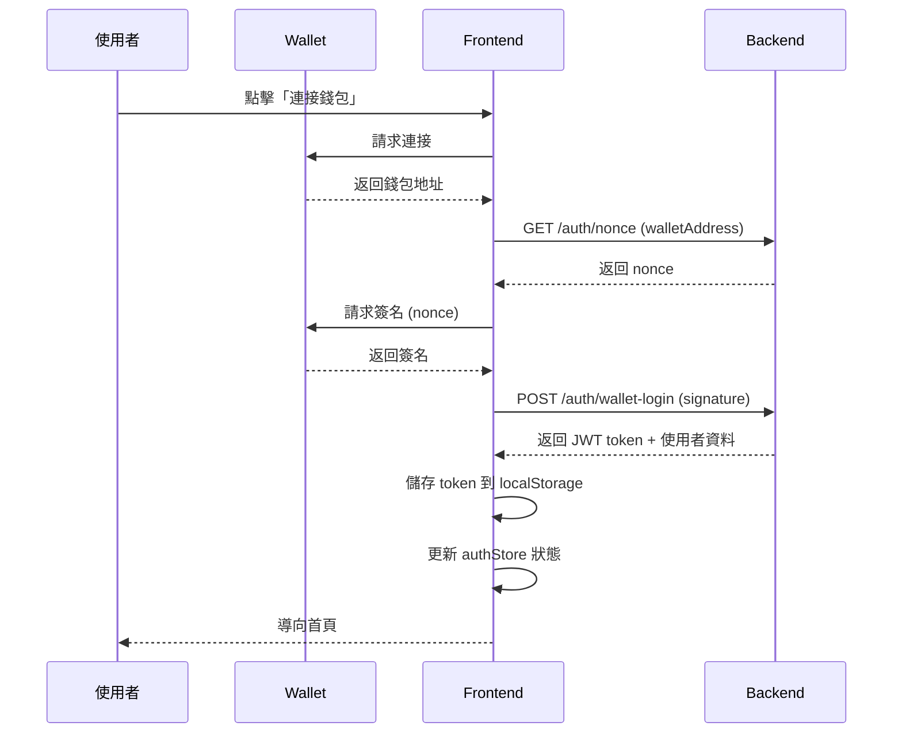

# TAXCOIN Frontend

> React + TypeScript + Vite + Tailwind CSS 的現代化前端應用

## 📋 目錄

- [技術棧](#技術棧)
- [專案結構](#專案結構)
- [快速開始](#快速開始)
- [架構設計](#架構設計)
- [頁面說明](#頁面說明)
- [開發指南](#開發指南)

---

## 🛠 技術棧

### 核心技術
- **React 18.2.0** - UI 框架
- **TypeScript 5.2.2** - 類型安全
- **Vite 5.0.8** - 建置工具
- **React Router DOM 6.20.0** - 路由管理

### 狀態管理與 API
- **Zustand 4.4.7** - 輕量狀態管理
- **Axios 1.6.2** - HTTP 客戶端

### UI 與樣式
- **Tailwind CSS 3.3.6** - 原子化 CSS
- **Web3 Dark Theme** - 科技藍 (#0ea5e9) + 紫色 (#d946ef)
- **Glass Morphism** - 玻璃擬態效果

---

## 📁 專案結構

```
frontend/src/
├── components/              # 可重用組件
│   ├── Layout.tsx          # 主布局 (導航、側邊欄)
│   ├── PrivateRoute.tsx    # 路由保護組件
│   └── ReceiptUpload.tsx   # 收據上傳組件
│
├── pages/                  # 頁面組件
│   ├── LoginPage.tsx       # 登入頁 (錢包連接)
│   ├── HomePage.tsx        # 首頁 (根據角色顯示)
│   │
│   ├── TaxClaimNewPage.tsx # 新增退稅申請
│   ├── TaxClaimListPage.tsx # 退稅申請列表
│   ├── KycPage.tsx         # KYC 驗證
│   │
│   ├── PoolListPage.tsx    # 投資池列表
│   ├── PoolDetailPage.tsx  # 投資池詳情
│   ├── MyInvestmentsPage.tsx # 我的投資
│   │
│   ├── AdminDashboardPage.tsx # 管理員儀表板
│   ├── AdminClaimsPage.tsx    # 退稅申請管理
│   ├── AdminKycPage.tsx       # KYC 管理 (待開發)
│   └── AdminPoolsPage.tsx     # 投資池管理 (待開發)
│
├── services/               # API 服務層
│   ├── api.ts             # Axios 配置與攔截器
│   ├── auth.service.ts    # 認證服務
│   ├── taxClaim.service.ts # 退稅服務
│   ├── kyc.service.ts     # KYC 服務
│   └── rwaPool.service.ts # RWA 投資池服務
│
├── stores/                # Zustand 狀態管理
│   └── authStore.ts       # 認證狀態
│
├── utils/                 # 工具函數
│   └── wallet.ts          # 錢包適配器
│
├── types/                 # TypeScript 類型定義
│   └── index.ts           # 所有類型和介面
│
├── App.tsx                # 根組件與路由配置
├── main.tsx               # 應用入口
└── index.css              # Tailwind 全域樣式
```

---

## 🚀 快速開始

### 1. 安裝依賴

```bash
cd frontend
npm install
```

### 2. 配置環境變數

複製環境變數範本:

```bash
cp .env.example .env
```

編輯 `.env`:

```env
# API 後端地址
VITE_API_BASE_URL=http://localhost:3000/api/v1

# Sui 網路配置
VITE_SUI_NETWORK=testnet
VITE_SUI_PACKAGE_ID=your_package_id
```

### 3. 啟動開發服務器

```bash
npm run dev
```

訪問 http://localhost:5173

### 4. 建置生產版本

```bash
npm run build
```

建置產物在 `dist/` 目錄

---

## 🏗 架構設計

### 1. 分層架構

```
┌─────────────────────────────────────┐
│         Pages (頁面層)               │
│  - 頁面組件                          │
│  - 路由配置                          │
└──────────────┬──────────────────────┘
               │
┌──────────────▼──────────────────────┐
│      Components (組件層)             │
│  - 可重用 UI 組件                     │
│  - 布局組件                          │
└──────────────┬──────────────────────┘
               │
┌──────────────▼──────────────────────┐
│       Stores (狀態層)                │
│  - Zustand 全域狀態                  │
│  - 認證狀態管理                       │
└──────────────┬──────────────────────┘
               │
┌──────────────▼──────────────────────┐
│      Services (服務層)               │
│  - API 呼叫封裝                      │
│  - 業務邏輯處理                       │
└──────────────┬──────────────────────┘
               │
┌──────────────▼──────────────────────┐
│         API (後端)                   │
│  - RESTful API                      │
│  - JWT 認證                          │
└─────────────────────────────────────┘
```

### 2. 認證流程



### 3. 路由保護機制

**PrivateRoute 組件**:

```typescript
// 三層保護:
// 1. 未登入 → 導向 /login
// 2. 角色不符 → 導向 /unauthorized
// 3. 通過驗證 → 渲染子路由

<Route element={<PrivateRoute allowedRoles={[UserRole.INVESTOR]} />}>
  <Route path="/pools" element={<PoolListPage />} />
</Route>
```

### 4. API 服務層設計

**統一錯誤處理**:

```typescript
// api.ts - Axios 攔截器
apiClient.interceptors.response.use(
  (response) => response,
  (error) => {
    if (error.response?.status === 401) {
      // 清除 token 並導向登入頁
      localStorage.removeItem('token');
      window.location.href = '/login';
    }
    return Promise.reject(error);
  }
);
```

**服務層範例**:

```typescript
// taxClaim.service.ts
export const createClaim = async (receipts: File[]) => {
  const formData = new FormData();
  receipts.forEach((file) => {
    formData.append('receipts', file);
  });

  const response = await formDataClient.post('/tax-claims', formData);
  return response.data;
};
```

---

## 📄 頁面說明

### 公開頁面

#### LoginPage (登入頁)
- **路徑**: `/login`
- **功能**:
  - 錢包連接 (Sui Wallet)
  - 簽名驗證登入
  - 新使用者註冊 (選擇 TOURIST/INVESTOR 角色)
- **組件**:
  - 錢包適配器
  - 雙面板 UI (登入 / 註冊)

### TOURIST 路由 (需登入)

#### TaxClaimNewPage (新增退稅申請)
- **路徑**: `/tax-claims/new`
- **功能**:
  - 3 步驟流程: 上傳 → 結果 → 成功
  - 收據上傳 (最多 5 張)
  - OCR 自動識別
  - 退稅金額預覽
- **組件**:
  - ReceiptUpload (拖曳上傳、相機支援)
  - 步驟指示器

#### TaxClaimListPage (退稅申請列表)
- **路徑**: `/tax-claims`
- **功能**:
  - 我的退稅申請列表
  - 狀態篩選 (待審核/已核准/已拒絕/已撥款)
  - 分頁
  - NFT Token ID 顯示
  - 區塊鏈瀏覽器連結
- **狀態徽章**:
  - PENDING (黃色)
  - APPROVED (綠色)
  - REJECTED (紅色)
  - DISBURSED (藍色)

#### KycPage (KYC 驗證)
- **路徑**: `/kyc`
- **功能**:
  - 護照照片上傳
  - 自拍照上傳 (相機支援)
  - 處理狀態動畫
  - 驗證結果顯示
  - 臉部比對分數

### INVESTOR 路由 (需登入)

#### PoolListPage (投資池列表)
- **路徑**: `/pools`
- **功能**:
  - 投資池網格布局
  - 狀態篩選 (募資中/已結束/已到期)
  - 填充率進度條
  - 剩餘天數計算
  - 分頁
- **卡片資訊**:
  - 目標金額 vs 已募集
  - 年化收益率
  - 風險等級
  - 到期日

#### PoolDetailPage (投資池詳情)
- **路徑**: `/pools/:id`
- **功能**:
  - 投資池完整資訊
  - 資產項目列表
  - 投資計算器 (份額 → 金額 → 預期收益)
  - 投資確認對話框
  - 成功狀態
- **布局**:
  - 左側: 詳細資訊
  - 右側: 投資面板 (sticky)

#### MyInvestmentsPage (我的投資)
- **路徑**: `/my-investments`
- **功能**:
  - 投資統計卡片
    - 總投資金額
    - 預期總收益
    - 進行中數量
    - 已到期數量
  - 投資列表
  - 投資進度條 (進行中顯示)
  - 分頁

### ADMIN 路由 (需登入 + ADMIN 角色)

#### AdminDashboardPage (管理員儀表板)
- **路徑**: `/admin/dashboard`
- **功能**:
  - 快速操作卡片 (待審核數量)
  - 退稅統計 (總數、金額、核准率)
  - KYC 統計 (總數、驗證率、待審核)
  - RWA 統計 (TVL、填充率、平均收益率)
  - 最近活動列表

#### AdminClaimsPage (退稅申請管理)
- **路徑**: `/admin/claims`
- **功能**:
  - 所有退稅申請列表
  - 狀態篩選
  - 審核對話框
    - 收據圖片預覽
    - OCR 結果
    - 核准/拒絕操作
    - 拒絕原因輸入
  - 即時列表更新

#### AdminKycPage (KYC 管理) [待開發]
- **路徑**: `/admin/kyc`
- **狀態**: 佔位頁面

#### AdminPoolsPage (投資池管理) [待開發]
- **路徑**: `/admin/pools`
- **狀態**: 佔位頁面

---

## 🎨 設計系統

### 配色方案

```css
/* 主色調 */
--primary-500: #0ea5e9;  /* 科技藍 */
--accent-500: #d946ef;   /* 紫色 */

/* 背景 */
--dark-bg: #0f172a;      /* 深藍黑 */
--dark-card: #1e293b;    /* 卡片背景 */

/* 文字 */
--text-white: #ffffff;
--text-gray-400: #94a3b8;

/* 狀態色 */
--success: #10b981;      /* 綠色 */
--warning: #f59e0b;      /* 黃色 */
--error: #ef4444;        /* 紅色 */
```

### Tailwind 自定義類別

```css
/* Glass Morphism 卡片 */
.card {
  @apply bg-dark-card/50 backdrop-blur-md border border-gray-800
         rounded-lg p-6 shadow-lg;
}

/* 玻璃效果 */
.glass {
  @apply bg-white/5 backdrop-blur-md border border-white/10;
}

/* 發光按鈕 */
.btn-primary {
  @apply bg-gradient-to-r from-primary-500 to-accent-500
         hover:shadow-glow transition-all;
}

/* 發光特效 */
.shadow-glow {
  box-shadow: 0 0 20px rgba(14, 165, 233, 0.5);
}

/* 響應式容器 */
.container-responsive {
  @apply mx-auto max-w-7xl px-4 sm:px-6 lg:px-8;
}
```

### 組件樣式規範

**按鈕 (Button)**:
```tsx
<button className="btn btn-primary">
  主要按鈕
</button>

<button className="btn btn-secondary">
  次要按鈕
</button>

<button className="btn btn-outline">
  外框按鈕
</button>
```

**徽章 (Badge)**:
```tsx
<span className="badge badge-success">已核准</span>
<span className="badge badge-warning">待審核</span>
<span className="badge badge-error">已拒絕</span>
<span className="badge badge-info">進行中</span>
```

**卡片 (Card)**:
```tsx
<div className="card">
  <h3 className="text-xl font-bold mb-4">卡片標題</h3>
  <p className="text-gray-400">卡片內容</p>
</div>
```

---

## 🔧 開發指南

### 1. 新增頁面

**步驟**:

1. 在 `src/pages/` 創建新頁面組件:

```tsx
// src/pages/NewPage.tsx
export const NewPage = () => {
  return (
    <div className="container-responsive py-8">
      <h1 className="text-3xl font-bold mb-6">新頁面</h1>
      {/* 頁面內容 */}
    </div>
  );
};
```

2. 在 `src/App.tsx` 註冊路由:

```tsx
import { NewPage } from './pages/NewPage';

// 在 Routes 中新增
<Route path="/new" element={<Layout><NewPage /></Layout>} />
```

### 2. 新增 API 服務

**步驟**:

1. 在 `src/services/` 創建服務檔案:

```typescript
// src/services/newFeature.service.ts
import { apiClient } from './api';

export const getItems = async () => {
  const response = await apiClient.get('/items');
  return response.data;
};

export const createItem = async (data: any) => {
  const response = await apiClient.post('/items', data);
  return response.data;
};

export default {
  getItems,
  createItem,
};
```

2. 在頁面中使用:

```tsx
import newFeatureService from '../services/newFeature.service';

const loadData = async () => {
  try {
    const data = await newFeatureService.getItems();
    setItems(data);
  } catch (error) {
    console.error('載入失敗', error);
  }
};
```

### 3. 新增全域狀態

**步驟**:

1. 在 `src/stores/` 創建 Zustand store:

```typescript
// src/stores/newStore.ts
import { create } from 'zustand';

interface NewState {
  items: any[];
  setItems: (items: any[]) => void;
  addItem: (item: any) => void;
}

export const useNewStore = create<NewState>((set) => ({
  items: [],
  setItems: (items) => set({ items }),
  addItem: (item) => set((state) => ({
    items: [...state.items, item]
  })),
}));
```

2. 在組件中使用:

```tsx
import { useNewStore } from '../stores/newStore';

const MyComponent = () => {
  const { items, addItem } = useNewStore();

  return (
    <div>
      {items.map(item => <div key={item.id}>{item.name}</div>)}
      <button onClick={() => addItem({ id: 1, name: 'New' })}>
        新增
      </button>
    </div>
  );
};
```

### 4. 新增類型定義

在 `src/types/index.ts` 新增介面:

```typescript
export interface NewModel {
  id: string;
  name: string;
  createdAt: string;
  updatedAt: string;
}

export enum NewStatus {
  ACTIVE = 'ACTIVE',
  INACTIVE = 'INACTIVE',
}
```

### 5. 處理表單

**推薦模式**:

```tsx
const [formData, setFormData] = useState({
  name: '',
  email: '',
});
const [errors, setErrors] = useState<any>({});
const [isLoading, setIsLoading] = useState(false);

const handleChange = (e: React.ChangeEvent<HTMLInputElement>) => {
  setFormData({
    ...formData,
    [e.target.name]: e.target.value,
  });
};

const handleSubmit = async (e: React.FormEvent) => {
  e.preventDefault();
  setIsLoading(true);
  setErrors({});

  try {
    await apiService.submit(formData);
    // 成功處理
  } catch (error: any) {
    setErrors(error.response?.data?.errors || {});
  } finally {
    setIsLoading(false);
  }
};

return (
  <form onSubmit={handleSubmit}>
    <input
      name="name"
      value={formData.name}
      onChange={handleChange}
      className="input"
    />
    {errors.name && <p className="text-error">{errors.name}</p>}

    <button type="submit" disabled={isLoading}>
      {isLoading ? '提交中...' : '提交'}
    </button>
  </form>
);
```

### 6. 檔案上傳

使用 `ReceiptUpload` 組件:

```tsx
import { ReceiptUpload } from '../components/ReceiptUpload';

const [files, setFiles] = useState<File[]>([]);

<ReceiptUpload
  onFilesChange={setFiles}
  maxFiles={5}
  maxSizeMB={5}
/>
```

### 7. 錯誤處理

**統一錯誤處理模式**:

```tsx
const [error, setError] = useState<string>('');

try {
  const data = await apiService.getData();
} catch (err) {
  const message = err instanceof Error
    ? err.message
    : '未知錯誤';
  setError(message);
}

// 顯示錯誤
{error && (
  <div className="p-4 bg-red-500/10 border border-red-500/50 rounded-lg">
    <p className="text-red-400">{error}</p>
  </div>
)}
```

### 8. Loading 狀態

**推薦模式**:

```tsx
const [isLoading, setIsLoading] = useState(true);

{isLoading && (
  <div className="card text-center py-12">
    <div className="inline-block w-12 h-12 border-4 border-primary-500
                    border-t-transparent rounded-full animate-spin mb-4" />
    <p className="text-gray-400">載入中...</p>
  </div>
)}
```

---

## 🧪 測試

### 運行測試 (待實作)

```bash
# 單元測試
npm run test

# 測試覆蓋率
npm run test:coverage

# E2E 測試
npm run test:e2e
```

---

## 📦 建置與部署

### 開發環境

```bash
npm run dev
```

### 生產建置

```bash
# 類型檢查
npm run type-check

# Lint
npm run lint

# 建置
npm run build
```

### Docker 部署

前端已整合到根目錄的 `docker-compose.yml`:

```bash
# 啟動所有服務 (包含前端)
./scripts/start-all.sh

# 僅前端
docker-compose up frontend
```

---

## 🔍 常見問題

### 1. API 連接失敗

**問題**: 前端無法連接後端 API

**解決**:
- 檢查 `.env` 中的 `VITE_API_BASE_URL` 是否正確
- 確認後端服務是否啟動 (port 3000)
- 檢查瀏覽器控制台的 CORS 錯誤

### 2. 錢包連接失敗

**問題**: Sui Wallet 連接失敗

**解決**:
- 確認已安裝 Sui Wallet 擴充功能
- 檢查是否切換到正確的網路 (testnet)
- 清除瀏覽器快取後重試

### 3. 圖片上傳失敗

**問題**: 收據或 KYC 圖片上傳失敗

**解決**:
- 檢查檔案格式 (僅支援 JPG, PNG, WebP)
- 確認檔案大小 < 5MB
- 檢查後端 `/uploads` 目錄權限

### 4. Token 過期

**問題**: 操作時提示 token 過期

**解決**:
- Token 有效期為 24 小時,過期後需重新登入
- 檢查 localStorage 中的 token
- 實作 token 自動刷新機制 (待開發)

---

## 📚 相關文件

- [專案總結](../PROJECT_SUMMARY.md)
- [後端 API 文件](../docs/API.md)
- [開發指南](../GETTING_STARTED.md)
- [README](../README.md)

---

## 🤝 貢獻指南

### Git 工作流程

```bash
# 1. 創建功能分支
git checkout -b feature/new-feature

# 2. 開發並提交
git add .
git commit -m "feat: add new feature"

# 3. 推送分支
git push origin feature/new-feature

# 4. 創建 Pull Request
```

### Commit 訊息規範

```
feat: 新功能
fix: 修復 bug
docs: 文件更新
style: 程式碼格式調整
refactor: 重構
test: 測試相關
chore: 建置流程或輔助工具的變動
```

---

**版本**: 1.0.0
**最後更新**: 2025-10-20
**開發狀態**: ✅ 核心功能完成,部分管理員功能待開發
